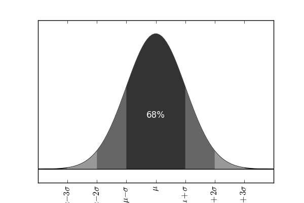

# Ejemplo: Gaussian plot

Un ejemplo de uso y utilidad de git.

Envías el siguiente gráfico incluido en el repositorio a tu colaborador.

El lo revisa y te responde con los siguientes comentarios:

Hola,

El gráfico se ve muy bien. Para hacerlo aún mejor te sugiero los siguientes cambios.

- Los tick labels del eje x se salen de la figura, levanta un poco el eje x para que tengan espacio.
- Aprovecha de agrandarles un poco la fuente.
- Los ticks del eje de arriba están de más, mejor bórralos.
- el 68% se vería mejor más grande.
- Está muy gris, por qué no intentas a ver como se ve en tonos azules?

Saludos!

Colaborador.

## Ejercicio nro. 1

La idea es aprender a usar github para entregar las tareas. El ejercicio consiste en seguir los siguientes pasos:

1. Crear una cuenta en [github](https://github.com)
1. Acercarse al profesor indicando el username para ser agregado al _team estudiantes_.
1. **Fork** el [_repositorio_](https://github.com/uchileFI3104B-2015B/gaussexample.git).
1. [**Clonar**] el _repositorio_ en su computador.
1. Agregue su Nombre Apellido e email como una leyenda al plot.
1. Use **add**, **commit** con un mensaje apropiado.
1. [**Push**] los cambios a su cuenta GitHub.
1. Cree un **pull request** en el repositorio original (en este momento la tarea/ejercicio esta entregado).

